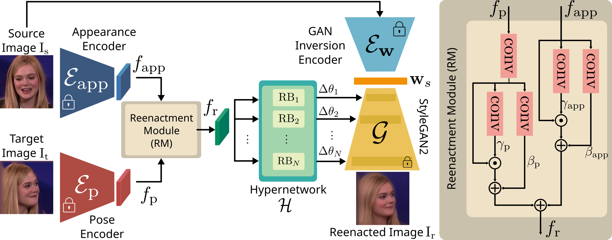
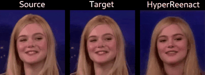
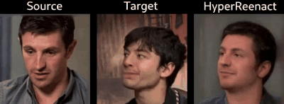

# HyperReenact: One-Shot Reenactment via Jointly Learning to Refine and Retarget Faces

Authors official PyTorch implementation of the **[HyperReenact: One-Shot Reenactment via Jointly Learning to Refine and Retarget Faces (ICCV 2023)](https://arxiv.org/abs/2307.10797)**. If you use this code for your research, please [**cite**](#citation) our paper.

<p align="center">

</p>

>**HyperReenact: One-Shot Reenactment via Jointly Learning to Refine and Retarget Faces**<br>
> Stella Bounareli, Christos Tzelepis, Vasileios Argyriou, Ioannis Patras, Georgios Tzimiropoulos<br>
>
> **Abstract**: In this paper, we present our method for neural face reenactment, called HyperReenact, that aims to generate realistic 
            talking head images of a source identity, driven by a target facial pose. Existing state-of-the-art face reenactment methods train 
            controllable generative models that learn to synthesize realistic facial images, yet producing reenacted faces that are prone to significant 
            visual artifacts, especially under the challenging condition of extreme head pose changes, or requiring expensive few-shot fine-tuning to better preserve 
            the source identity characteristics. We propose to address these limitations by leveraging the photorealistic generation ability and the disentangled properties of a pretrained StyleGAN2 generator, by first inverting the real images into its latent space and then using a hypernetwork to perform: (i) refinement of the source identity characteristics and (ii) facial pose re-targeting, eliminating this way the dependence on external editing methods that typically produce artifacts. Our method operates under the one-shot setting (i.e., using a single source frame) and allows for cross-subject reenactment, 
            without requiring any subject-specific fine-tuning. We compare our method both quantitatively and qualitatively against several state-of-the-art 
            techniques on the standard benchmarks of VoxCeleb1 and VoxCeleb2, demonstrating the superiority of our approach in producing artifact-free images, 
            exhibiting remarkable robustness even under extreme head pose changes. 

<a href="https://arxiv.org/abs/2307.10797"></a>
<a href="https://stelabou.github.io/hyperreenact.github.io/"></a>


## Neural Face Reenactment Results

<p align="center">


</p>


## Code is coming soon


## Citation

[1] Stella Bounareli, Christos Tzelepis, Argyriou Vasileios, Ioannis Patras, and Georgios Tzimiropoulos. HyperReenact: One-Shot Reenactment via Jointly Learning to Refine and Retarget Faces. IEEE International Conference on Computer Vision (ICCV), 2023.

Bibtex entry:

```bibtex
@InProceedings{bounareli2023hyperreenact,
    author    = {Bounareli, Stella and Tzelepis, Christos and Argyriou, Vasileios and Patras, Ioannis and Tzimiropoulos, Georgios},
    title     = {HyperReenact: One-Shot Reenactment via Jointly Learning to Refine and Retarget Faces},
    booktitle = {Proceedings of the IEEE/CVF International Conference on Computer Vision (ICCV)},
    year      = {2023},
}
```


## Acknowledgment

This research was supported by the EU's Horizon 2020 programme H2020-951911 [AI4Media](https://www.ai4media.eu/) project.


